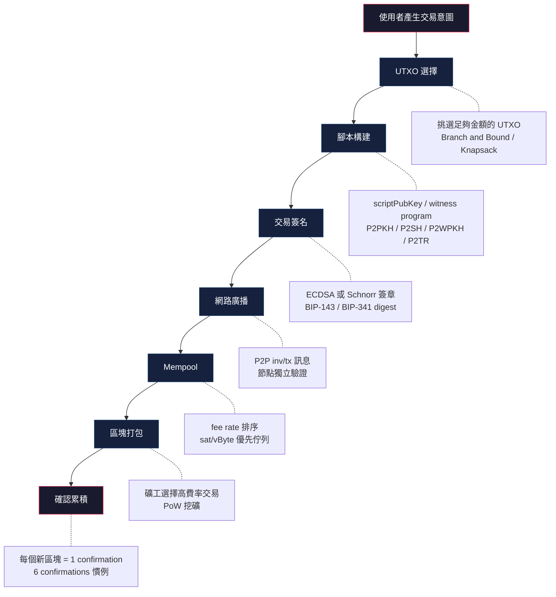

# Bitcoin 交易生命週期

## 概述

一筆 Bitcoin 交易從使用者意圖到鏈上確認，經歷 UTXO 選擇、腳本構建、交易簽名、網路廣播、Mempool 等待、區塊打包、工作量證明確認等階段。與 Ethereum 的帳戶模型不同，Bitcoin 採用 [UTXO 模型](/bitcoin/data-structures/utxo-model/)，每筆交易消耗先前的未花費輸出並產生新的輸出。本筆記作為 Hub，串連整個 Bitcoin 交易流程。

## 完整流程圖



## 各階段詳解

### 1. UTXO 選擇

錢包掃描可用的 [UTXO](/bitcoin/data-structures/utxo-model/)，挑選總額足以覆蓋支付金額加手續費的子集。Bitcoin Core 使用 Branch and Bound 演算法尋找精確匹配，避免產生找零輸出；若找不到精確解則退回 Knapsack 隨機近似搜尋。

詳見：[UTXO 選擇](/bitcoin/transactions/utxo-selection/)

### 2. 腳本構建

根據收款方地址類型構建輸出腳本。傳統地址使用 [P2PKH](/bitcoin/transactions/p2pkh/)（以 `1` 開頭），[P2SH](/bitcoin/transactions/p2sh/)（以 `3` 開頭）支援多簽等複雜邏輯，SegWit 地址使用 [P2WPKH/P2WSH](/bitcoin/transactions/p2wpkh-p2wsh/)（`bc1q` 開頭），Taproot 使用 [P2TR](/bitcoin/transactions/p2tr/)（`bc1p` 開頭）。

### 3. 交易簽名

使用私鑰對交易摘要簽名。Legacy 交易使用 [ECDSA](/fundamentals/cryptography/ecdsa/) 搭配原始 sighash 序列化；SegWit 交易遵循 BIP-143 新摘要演算法；Taproot 交易使用 [Schnorr 簽名](/bitcoin/cryptography/schnorr-signatures/) 搭配 BIP-341 tagged hash。

詳見：[交易簽名](/bitcoin/transactions/transaction-signing-btc/)

### 4. 網路廣播

簽好的交易透過 Bitcoin P2P 網路的 `inv` / `tx` 訊息傳播。每個節點獨立驗證：檢查輸入的 UTXO 存在且未被花費、腳本驗證通過、手續費非負。

### 5. Mempool

通過驗證的交易進入節點本地的 [Mempool](/bitcoin/network/mempool-btc/)。交易按 fee rate（sat/vByte）排序。使用者可透過 [RBF](/bitcoin/transactions/rbf-cpfp/) 以更高費率替換卡住的交易。

### 6. 區塊打包

礦工從 Mempool 中選取高費率交易填入區塊（上限 4M weight units），透過 [Nakamoto Consensus](/bitcoin/consensus/nakamoto-consensus/) 進行工作量證明。找到合格 nonce 後廣播新區塊。

### 7. 確認累積

交易被包含在區塊中即獲得 1 confirmation。每增加一個後續區塊，confirmation 數加一。慣例上 6 confirmations（約 60 分鐘）被視為不可逆。

## 與 Ethereum 交易生命週期的比較

| 特徵 | Bitcoin | Ethereum |
|------|---------|----------|
| 帳戶模型 | [UTXO](/bitcoin/data-structures/utxo-model/) | Account-based |
| Nonce | 無（UTXO 本身防重放） | 帳戶序號遞增 |
| 手續費計算 | `fee = sum(inputs) - sum(outputs)` | `fee = gasUsed * gasPrice` |
| 費用單位 | sat/vByte | gwei/gas |
| 腳本語言 | [Bitcoin Script](/bitcoin/data-structures/bitcoin-script/)（非圖靈完備） | EVM bytecode（圖靈完備） |
| 最終性 | 概率性（6 confirmations） | 確定性（Casper FFG finality） |
| 簽名方案 | ECDSA / Schnorr | ECDSA |
| 區塊時間 | 約 10 分鐘 | 12 秒 |

## 交易結構

```
Version (4 bytes)
Input Count (varint)
  ├─ Previous TX Hash (32 bytes)
  ├─ Previous Output Index (4 bytes)
  ├─ scriptSig Length (varint)
  ├─ scriptSig (variable)
  └─ Sequence (4 bytes)
Output Count (varint)
  ├─ Value (8 bytes, satoshis)
  ├─ scriptPubKey Length (varint)
  └─ scriptPubKey (variable)
Locktime (4 bytes)
```

SegWit 交易額外包含 marker、flag 和 witness 欄位，詳見 [SegWit 序列化](/bitcoin/transactions/segwit-serialization/)。

## 手續費公式

Bitcoin 的手續費隱含在輸入與輸出的差額中：

$$\text{fee} = \sum_{i} \text{value}(\text{input}_i) - \sum_{j} \text{value}(\text{output}_j)$$

費率以 sat/vByte 計算：

$$\text{feeRate} = \frac{\text{fee (satoshis)}}{\text{weight (WU)} / 4}$$

其中 weight unit 的定義見 [SegWit 序列化](/bitcoin/transactions/segwit-serialization/)。

## 時序與延遲

| 階段 | 典型延遲 | 備註 |
|------|----------|------|
| UTXO 選擇 + 簽名 | < 100ms | 本地運算 |
| 廣播到多數節點 | 2-5s | P2P gossip |
| 進入區塊（1 conf） | 約 10 min | 取決於 fee rate 和 mempool 狀態 |
| 6 confirmations | 約 60 min | 慣例安全閾值 |

## 程式碼範例

```javascript
const bitcoin = require('bitcoinjs-lib');
const { ECPairFactory } = require('ecpair');
const ecc = require('tiny-secp256k1');
const ECPair = ECPairFactory(ecc);

// 1. 建立金鑰對
const keyPair = ECPair.makeRandom();
const { address } = bitcoin.payments.p2wpkh({
  pubkey: Buffer.from(keyPair.publicKey),
});

// 2. 構建交易（花費一個 UTXO）
const psbt = new bitcoin.Psbt({ network: bitcoin.networks.bitcoin });

// 加入輸入（引用前一筆交易的 UTXO）
psbt.addInput({
  hash: 'previous_txid_hex...',
  index: 0,
  witnessUtxo: {
    script: bitcoin.payments.p2wpkh({
      pubkey: Buffer.from(keyPair.publicKey),
    }).output,
    value: 100000, // satoshis
  },
});

// 加入輸出
psbt.addOutput({
  address: 'bc1q_recipient_address...',
  value: 90000, // 支付金額
});
// fee = 100000 - 90000 = 10000 satoshis

// 3. 簽名
psbt.signInput(0, keyPair);
psbt.finalizeAllInputs();

// 4. 序列化並廣播
const rawTx = psbt.extractTransaction().toHex();
// 透過 bitcoin-cli sendrawtransaction 或 RPC 廣播
```

```python
# 使用 python-bitcoinlib 構建交易
from bitcoin.core import (
    CMutableTransaction, CMutableTxIn, CMutableTxOut,
    COutPoint, lx, b2x
)
from bitcoin.core.script import (
    CScript, OP_DUP, OP_HASH160, OP_EQUALVERIFY, OP_CHECKSIG
)
from bitcoin.wallet import CBitcoinAddress
import bitcoin

bitcoin.SelectParams('mainnet')

# 構建花費 P2PKH 的交易
txin = CMutableTxIn(
    COutPoint(lx('previous_txid...'), 0)  # 引用前一筆 UTXO
)

# 建立輸出：支付到 P2PKH 地址
destination = CBitcoinAddress('1A1zP1eP5QGefi2DMPTfTL5SLmv7DivfNa')
txout = CMutableTxOut(
    90000,  # satoshis
    destination.to_scriptPubKey()
)

tx = CMutableTransaction([txin], [txout])
# fee = input_value(100000) - output_value(90000) = 10000 sat
```

## 相關概念

- [Transaction Lifecycle (ETH)](/ethereum/transaction-lifecycle/transaction-lifecycle/) - Ethereum 交易生命週期對比
- [UTXO Model](/bitcoin/data-structures/utxo-model/) - Bitcoin 的基本帳戶模型
- [UTXO 選擇](/bitcoin/transactions/utxo-selection/) - 輸入選幣演算法
- [P2PKH](/bitcoin/transactions/p2pkh/) - 傳統支付腳本類型
- [P2TR](/bitcoin/transactions/p2tr/) - Taproot 支付腳本
- [交易簽名](/bitcoin/transactions/transaction-signing-btc/) - 簽名流程詳解
- [SegWit 序列化](/bitcoin/transactions/segwit-serialization/) - 隔離見證交易格式
- [Fee Estimation](/bitcoin/transactions/fee-estimation/) - 手續費估算機制
- [RBF/CPFP](/bitcoin/transactions/rbf-cpfp/) - 交易加速手段
- [Nakamoto Consensus](/bitcoin/consensus/nakamoto-consensus/) - 工作量證明共識
- [Mempool](/bitcoin/network/mempool-btc/) - 記憶池運作
- [Bitcoin Script](/bitcoin/data-structures/bitcoin-script/) - 腳本語言基礎
