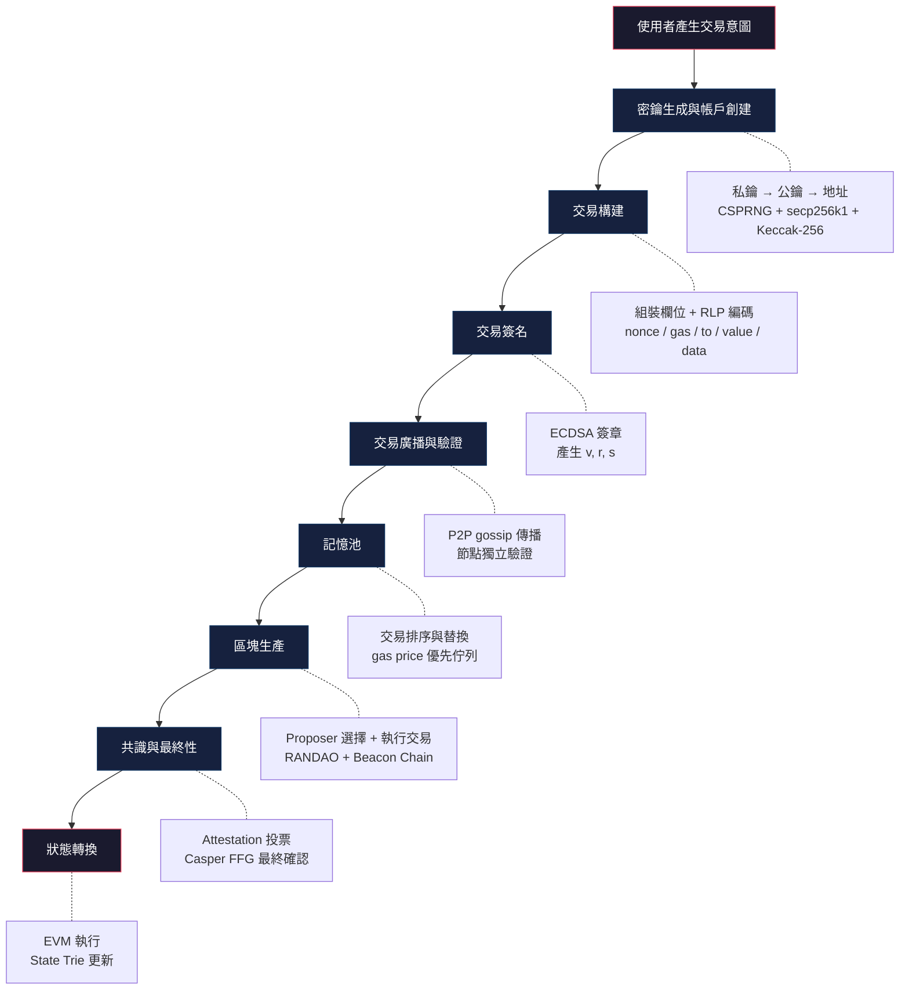
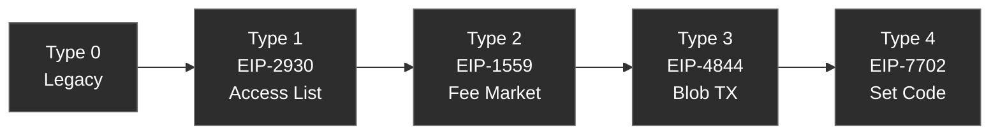

# 交易生命週期


import EthBuildEmbed from '../../../../components/EthBuildEmbed'

## eth.build

透過 eth.build 操作 Transactions 節點，視覺化理解交易從構建到簽名的完整生命週期。

<EthBuildEmbed
  client:load
  src="https://sandbox.eth.build/wofCrGxhc3Rfbm9kZV9pZMONAcKtxIHEg8SFbGlua8SLxI0CLsKlxIfEiXPDnAAdworCosSMxI7CiMKkdHlwZcKwU3RvcmFnZS9WYXJpYWJsZcKjcG9zwpLEjsK9w4zDkMKkc2l6ZcKCwqEww4zCjMKhMRrCpWbEgmdzwoDCpcSwxIlyAMKkbcSIZQDCpsSVcHV0c8KRwoPCpG5hbWXEpG7EqMSqxaLCpMSUxJbDgMKnb8WnxabFqMKRwoLFrMWuxL3Fu3TCpcW3a8Wpw40CA8KqcHJvxKtydGllc8KCwqd2xLfFrcWvwqXGjmljZcKmZ2xvYmFsw4PCicSkxI0BwozFs8Srwq9EaXNwxIJ5L0FkZHLGlXPEvsWAxYIDwoTEjsOgxYfFiWXFggFUUMWUxZbFmMWacsWcE8WfxaHFo8WlxafFqcWrxptlwqDGr8W1xofGigXGjcaPxpHGk8aVwoTCq8S7b2NrxpRTx4cywqvGtWHGoGhvbMWcwqDCpcaTdMS8wqfGuca7xr3CpcaZbHVlw5kqMHg2ZjRjMmJixIk2MzJmOWQwNTU0yJ0yYTJlyI5kZjFhMzQyZDjIoGJlxKPEpQHCjceexrHGs8ezxrdEx7fEgnLGvsS_xYHDjQPCrMaKwoDHhsWKwpLDjMK-N8eNxLLHj8WbZXIVx5TEiceWbsW9x5nGgcWvx53EqcSrxZ7HoAIGxbrFvMeYxarJmMecx57Cpm51bciucsaGxJXGiMOAx6PGkMmPx6Zzx6jHqsesx67HsMeyxILHtce3xZzCr2VudMmPIMqEeHQgaMmPZce7ace9ZcKnyLlsyLtzyIPGp8iGAMaqyLHCiceewq3Gssa0xrYvV2F0Y2jGv8i_AmzDjMaAxYjJhsOMw4g8yYvFl8WZyY5yCsmSxaLFpMmVyaPChMmlyZrFtMmdya_GigPGhsS6ZWzCoMmyx6XGlMWYyLDGrMKHx57Crk3EiHXEvHMvy5Vky5fEvci-x4nCuMWyyq_HiMWPxJvFlcmMyrbHkcmPAcq6AMmhdMmWyaTHm8adxLjGoMeeAMmuxJZzybHGjsmzxpLLjsKDwqfKgsS6xLxkwqJvbsqOypDCpVDLtcqNY8e3xLDCpjdlY8yWMsKoc3ViZ8SxcGjEgMSCxITEhsWhxJgPxJHMo8aHxJgRxJzFoXPCm8uQBcqeVcaTbMuZVG9GxqTKpcqpx4F6yrHJhcukwqoeyrTJjcuqcgfLrcq8y7HHmsaCy4HJnMW2ya8Ey6_NjMuAyafJqcmryY_LucaIwpIFBsuMybTLjsKAyptkBsqeyqDIt8qjyqXKp8y9yYBSRs2ByYfDscqzy6fKtceQxZwIzYrHl8W-yr_Hm82Px5_JrwXLh8iuy4rNoMu_xpXCgMuQA8qeQ8yIdMaPbC9UacWvcsy9w4zCtMOMw5zNgcWMxY7FkMWSzYXLqcWcxZ7FoMmTzZTKvsmlxbpuX8aTx6zHnsO_zZvFqQrOg8uJwqczMM64MG1zzobJtcKCwqjElcqEcsiEw411MMKlZXbKgnTEqMafa8KoYm94zJDGpHLCpCMyz5nLkM2JyZvErMSuxLDEssS0xLbEuMyEy57HgMONBFbJiM6cxY3Fj8WRxZPNtc2GxZwJzbrKvcW-zY3Fr8Wxy7fNkcSWyaDGhMuxxoDHm8KjxoTOscKRC869y47Gl8aZcsuzxp7GoMaixqTGpsaozaTKuc-dy5TLlsuYL0_JonTNrQRqxI42zbHOmCjOoc23yY_Kuc6lyrvNu8mXzb7Pu8aH0IfLvcuNxpXCgcmly7TGn8ivxqsLx57CqknPts6SZcqIzL1QxI5ozbHEjiwy0KbKt8us0KrJlM2V0K7PncuDxbjOp8-3zZbPncKmxITEuG5nzrHCkNCIx6fHqcakybllx6_Fisexx7PJvse4yY_KgcqDyoXKh8qJyovGvMyKxLzCpFTRgcaFyITIhsOZNWh0y7BzOi8vYXBpLsSxZMS3xrzGti7MkG0vdjIvbcS3a2XFqMqjRVRILURBSS_OrdKXcsuQAtC80L7FvdGA0YLLn1DNsMujx4nRidGLzYfSp9GOzYvJo8-4yabRks-8a8W5z7_SuNGXxbTRmc6PxJXRncaHxakM0aDJttGix6vHrdGlybvRqWXHttGrctGtz4LKhtG4yorKjNG0ZdG20bjKl8iFyIcx0b7SgNKC0oTShtKOb8SV0pVy0pfKptKF06nSkHYx0qLPjsmPL9KY0bJlyaovy5DLrM-dwq9O0ph3xLBrL1JlcciGxITNrQHCrsOMx53Lo86dzpjFkcumx47OosmPBM-1yZbCktK5wqVbdXJsXcmn0ZrThdK8DNK5wqfGvNSKxpXPjM-dw7_SvArRlcWpzb3GgsKm0r_Ur9OCxqVqzJXGhdOHwpEOzrRsAdOKwoLCo9ShbMOZ06PRv3DSgdKD0oXSh8yQ06vSltKYY9Ow0o_SkdO00qPTt9O5yozTvMKoxInPkXVuxqDJgMOoy5AOx57CrNKpxacvTsmqyazNrQIc0YXQo8K-0YrPscKBwqnPlMSC1Y5lZMOD0KdyzovSttCsy7LNjtCvya_SvtCc0K3WidGYzZjJrNCFD9OKwoPJvMe005LJv8mPwqEj05zCptWwzZnJrdG6ZcWNy5AN1atPYtS9Y3QvxJXEiXjVs8KKxI5A1bfNtNSX1oPMstaGz7bFgdK50IPWqtaKxJYO1J7Wr9GBzZfVscmP0rwP1LTUndC21qPHnsKz1KbRnCzUvNS-LNKLYXnQhRHXhG7WsNeH1qHOscu8x6TNoc6Iy5DUmtSA1qnWq9at0LLJtHnVs8Kez6vSsMmIzYTPsdSYcs2m1rvRkMaC1r9q14FrEdS01ojJmceex7rVgATTisKB06DIhsKp0I7EinVzZM6xwpnClgQEAAUAAMKWBdiZBtiawpYG2JkH2KAKAwABAcO_wpYL2KQK2KAMAtioxaPXkmfClg4BAA3YoA8O2LoByajXiHLClhHYu9iXxaPMncW71Y7CkMKmzJBuZmlnwoDGmMmPxYjMiMOLP8OZwpnZm9mbwprNpMSOwpTItM2oyqLIgMa8c8i9z6cFw5Io0YfHiseM17bWgxHUm9OA0ZHLgtK8xorQsdekzofTi8m4047RpmXRqMm91pnTlMe6x7zHvtmlyILWo8iIyIrIqce0ZjDIpTTIpWU5yJIxMTdkzJZlyIww2o0yNzY4NDgzNsyVNWXZnwHCk8eewrHPn8SxxLMvRmnEvCBEx6TNrQPCtsOMwpbQo8OCJNKzxZzStceV2ILSudS40JzUpdOE0ZzQhcaKCtiJwqTZkMS8wqJ7fcuQxI7Cm9WrzLTatcy3byBXZWnNrQY2xI7Dgs-sxY7Cqs-v24LJjwzZs9GWy7PNu9egyazZtwIU24bJpduIy7DFp9uzzZrVgMaKFtiJ1aHMlc6UxqdzEtuXAc2_wq3bm8y2zpLbnkd326Hbo0rGiibbqNSQ26vZsMq30LvXutm0xoLCpduy1pDZgtu1G9u4x5vbusW9273Jrdu_1bTcgsSJY9yFzLYS2qvCoc2nyLbKosqkyqbKqMufyYDCosmAFtCjyrLbrHLdgdyezbzTgc2QyZ4d1YPLi9et2bvOicarxI7Co8eexK3Er9qxz6LEt8S5xLvPpsi_BMKcxI4Y3JjOn8-w1rjKt9aFx5XSt9uwxoLPutK7xofWjNu7xb7Qgde80ITcrR7VhsaYxprcoNiO0JDGpcanw4PcicKiyp5NyqVoy5rLl8aTxrXXr9y9BcK-0KHNsXjWt8uo1oPWp92H1r3JpcKhQdyr27Ue0rnCoULem8meH9ynxoLCoT3cq9uNAiDWld6Zw4tAYBFOOcKwwpTCot6f2ZjCqdmc2Z3Cok9QwqEq3InCpNmi3LjXmS_Kk8qV26PCmt2h1bfJitybzYcQ26_WjtiE3a7LhN6q3qTfk9OC1pHbvsmvy7vTism30aPZvtOQ2oLTk8qAz4vRr9OZ07rTnMqSyLrEt8qW1qPerhnCtUnDtcOnVDfcicKd1avVrdat1qDVst6MRsaKOtW31bndps2H1JreltiD0rrZtt2v35fgoIrEq9mB16HcrRvWldaX0arFnNac1p7fvc2a1qPCpjEwLs64MdyJwprfutC_4KCazpbfv9um4KCD3YTWut2p1ofSuc2_0ZPSveCgjc2_4KCQ1pLTh8WC27bGih_goJTTkd-k1pvWndqGxqHgoKfYi9Od4KCfyJraq8Kn3LfKod-F3LrNrNy9CMOKxI7DvtGHClHeks22yrfdouCgiNS235jdit-V1p3Egs6E3Y7Zusm13ZHIscKOyLTboGIzL0LfoMqnYcSVzpfCqsSOwobcmMOSxZF-3YTXueCgrta84KCJwqxb2b3gobHEldSk0ZjYtdK83bDJlsKW0rnCquCig2jgobLFsuCih9uL04bfnMKRxorXnMmlwqnQkmHVpWUoKceewqhm1aTWrGnMiM6x4KC5B8aK14POqcSH4KKe4KKg4KKi4KKk1aXGk-CiqNOHw4DSucKt2b3goKfgorHPneCio-CipeCitcyJ4KK34KK5zo_gop1zx7Tgo4Hgor3FtOCiv-CitOCip-CjguCilsaKJduHc8qCZOCjisSr4KOM4KKm4KK24KOQAiTduGHGutmmc8KgwqjLvXbEjMmPw5k906TVjtOm0pXElW7SmC7EleCipMSx4KOzb9KR4KGtZTU5YzQ2yI7IlciWNMyUMjnIlGY12o8wyJQ4yK7IljjcicKQ3ZXgoavgoa1UxLFu4KOH4KOabs2tB07EjnzcmMOwxZHDjMK63YQU35HCmdK54KKB4KKP4KKR4KKG04LgoojJnuCimceb4KKBxp7GmcqE0pd54KSv4KCP4KSx35Ut0rnCpFvEr-Cku8ah4KS9xJbGii7UqlvWo-ClhMKt35pyLOClhmvcgNuHW9KKdGHgpYTTg9GbZ-CiidSeW2fEg-CljeClj-ClkeCilOClnsmlwqrgpaDEg8yN0LjgpaPZguClpeClnNu1HOCliuCir8ag4KWu1qHgpbDUp92v4KWAxYhn4KKSxbTUscmeCNS0wpPSucKr4KOF4KSZ4KOI4KOOyafXldas3qki4KOT2ZHgo7Fk24rgpZzgoqnGiiPcluCmkeClvtaAzq_eqSfTisKI4KGFw4tDyI1XwoXDmMKgy7jgpbVlw4DCpOCll2HCosiKwqPgpaFzw41Zw5jCqOCmteClrMagw4_YmgACVBsmQOCjpcaP4KOnxZzgo6rgo6zVj9KU4KKR4KOxdOCjs9mP1KFh4KO34KO507jgo7zgo77gpIBj4KSCyI3gpIXgpIcz4KSJ4KSL4KSN4KSPZjjHo2ngpLdlS2V5w5lCyIramDfInWM5yJcxNsiRMDcy2qkx2pzgpI022pow2qM0YcicNzMxZmE5N8S6ZOCnu2HanGJmYuCkgGE0NWM3OOCkgMiowqLEr9qLyIvIjciPyJHIk8iVyJfImcibyJ3an8iiY8ikyKbIqMiqyKzIkNqq3ZLVheChi82p4KGO3LzPpwpaxop20YcDMeChmM-yyY8a35HCkeChneCgjs6A4KWHAtCl4KGiy4ngoaTLvuChptyJwqjLk9yNy5lG4KOA4KOOza0Iw57GiuCpl9SSz63DpsWRQt2EGd-R4KaF3Yll4KOZ4KOB27Uk4KWA1ZfKlM6v27Un4Kab4KaT4KaV4KW635Um14zUnteP0ZLgppfgqY_GiirgoLDgpp7gorfVhsmlxYfgo5XCqcS3Z8mqz4tzwpDcicKp4KmYzLXgqZrgqZzMiM2tCQbJgFzcmOCppTHgqaffjsWcG-CpquCqhuCivuCis-Ckm9u14KOS4KqK4KmzbOCptcmeKeClgOCikHPRhuCik-ClscmeKuCpvteOypjTneCqgdytK-CqqOCmgNei4KqJx5vgpofgpJjgpJrgo4Hgqo1y4KqPxa_Kg-CqktyJwpXfg-ChjMi436zIvOCknVg834zdhBLgqYngq4PgoZ_gqY4M4KC03qjgqojdj8m135_Tjcm60afgoJXag9-l0a5y05jKiNOa0bPgoYLfq8qU363goYUA3InCq86Mzo7OkM6SzpTJj-CpnnDJgOChqeCpo86e3JrHjtW71b3SheCjlNaB1oPNidGO2ILgqYvOqs6sz47gqofgo5wp1YPCps63zrjOu9WGz4Dgq7DPhAvCuM-Iz4rKg8-Nx6zPkM-Sz5TEsM-Xz5ky2qvCrdqu2rDPodqz2rVl2rfaucufw4zDsMmD2r_bgeCqpMmPzbngrJPUud-SxqHUueCputuM3K0s25DbksWw25XcicKR4KCl0qpCxafEr-CknNy9B9W1AuCposeHyYfDiOCghN6TyrfPtOCgiOCroGXgpoHWi-CqvNm1xKvOsNytCOCtqMKnz5HHt2Xgop3gq4Xgq6fMgOChhcKoY8SUx6wgxpzgoYLCpuCtl9G_4KKozJDVpHQKwovgqLfCksuTy5vLncuZ4K6PxLzQnsOEWtCjwrJq3YTVqt6W143Hm-Cim8an4KKdxqDgo5fgqY3gpZMC4KKtx5vCqG3go7HFoG7Gn9e_247UtMKU1Krgo6DIgdmny7feqQvgpobgpLbKpeCsuuCkueCut9yt4KS_zqlk4KuXc-Cuv-CjnNSpzqngopzgop7gr4bLutGf4K25xpXMgcyD3ZzgrJDgq7ZBzJbFu8qDwqXgrK5ywqZm4KSJN8iPzJnMm8yd0oXMoMyoxIXEncSKxIwm4K-nX8yqxIxezK3EnsSgENO-yLRDcsSqxK_LmuCuq8yIxp_MvQzEjsOG26jDikM64K-e4Kmm3YTgoIfgob7JluCpq8eb4KWp4K6qZeCurMaf4KWa4KWSXOCliteFeOClmuClj-Clp-CuqMSz4KOxxLHKhOCqseCtq-Cth-CuncaCx7LEuOCnqSDgrr7gqrjThdCFAdK54K6p4K-94K6tY-Cti-Cilcu616PgqZTLjtiK4LCZyprGq86L1IDZo9-F2ojZp9WzHsSOwrzZrceL3YTgrJLgsIzcn-ChnuCupALfntOM0aTZv9qB1pjgoL9y2oXKj9qH4KOh2ongqr7gqKLajWPaj9qR2pPalWTal9qZ2pvandqf2qHao9ql2qdj2qnNpM25z53CquCxgsa3UVLgsYbGij7ZrcKQxI7CkN2E4K2m4LGO3Yjgra3grqQH1YPgqKLajznIrDM4MeCyjzYxzJY2yJzWgGPgqJbEuuCogTPHtMiqN9qPYeCojuCyljnYicKmcXLZv92hy5DQu-Cxgd-E4KuW4Ku44KuY3L0Ew67EjuCrntezyYngrprgq5_gqazgoLIJ4Kuk3KPgoJHfnOCwudCz2bzfoOCrq9qA4Kut4LGZ05bfp-Crs9-p4Ku234fgq7nWo-CwvsSM1arQluCuksaV0JrQnNCeJ8aKw4XQo8K00KXgrYPKuOCyu-Cyh-Cgsg3bkMebwqfgrrTgo6LSpuCvt-CvuXDgr7vgp6t5IFDgobLgoKjHgMOMw6jgsYjgsIRDU8KZwprgsIngs6LgoK3Jk92q3pfHm8KtW-Cuu8qE4LCr4Kes4LCV4KWmxofgsLDJpeCmusqCyY_grrzgsKPRlOCth-CwjuCwp-C0iuCuveCnrOCwttCF4K6nxoLGjcyb4K2-4LSMeeC0n-Cjg86p4LOrxr3gtKjfnMKUAgQH4LOn4K-Pc8KB4Ken4Kep4LOy4Keu4KewN-CnssiO4Ke1OeCnt-CnueCnu-CnveCnv-CykuCoguCohOCohuCkhOCoieCoi-CojeCoj-CokeCok-ColeCol-ComeCom-ConTTIqM2k1qfgs5bQmOCzmNCb3bHQniTGiuC0p9ez4LOg4KG84LOk1o_goIvJrw7gs6jgtJvgsKngrrzgtKbMseCrvsqD4KyAzpPOlc6X4Ky_AU3do-CsismM4KyM36zVv-CskMq3zqTbheCth-Cpis6pzIjgrJfOrtSw0IXLhuCpkWzgrJ3OueCsoOC0tM6_z4HJj-CspOCsps-Jz4vgrKrPj8-Rz5PMkc-Wz5jPmsar0JXFtMKt3oR03oZN3ohp3orQnuCilwHCnN6Q4KmF17fbruCunN6e3prgs4DbtMaH4K2x3pjeoOC2uNeJxocQ4KCN3qbgq6XfnMKSCd234LS0woPerd6v3rHes9613p8A3rzevirNpNmy4LWay5zQmeC1ncW90J44yYA04LOf4LOh4KCFxZwP4LWm4LGQ4KCy4LeI4KGl4LC74K-C4K-EzaTgq57gt5fgrpDgs5ngtZ7gsrNMyYDCmOC3oN2E3pXgsoXgrYjgoLHSvOCgvOC0tNC14LOp4K-KxqDLkM2m0JbgqZnas8aPbduf3JPcvQLDpMSOzYngrIjcmc6g1brVvOC1vuCsj8OC1oPcneC3uuCgidyhz7beoc6B4KCN3KnbvOC2vtys4LeFEOC3vuC3qdC03IPcsdKV3LPNpNuuz53gtqXgtZvLmd-7zL3goIACYuChuMWRJt2E0Y3gtoPWjeCgieCwsuCwkuCvvuCwtd2v0IVc4LWrxa_guYPgsJNjy5DPtM-d3ZbPoNqyz6Pdm-Cuk9y9A8OM4LO74LiS3aTdhNuE4LSE4KCvyaXdreC1qOC0mOC5gd2zxa_Qg8Wn0IUI3bjQi9CNzI7dvdCS3oDGq9eoxbTCruC4h-Cpm-CjjeCqmty9AcK4xI7ZsuC4kuCqoeCqo-C3ouCthOCqp-CprOCpruCmi8aHXuCpssan4Kqw1LDSvAPgrrPgsZ7grrbgsK3RnNK8zZPgsKXgqb_gqr7gr4zGiMKRBeCtqOCtr-CzguCrhsaC4K2z4K6g4KKe4KuM4KuO4KqRwpDNpN-Q4Liy4LOX4Li1z7bMvSjOmuC4uzHguL3gs6LdqM6m4LaE0rngrp_EguCisOCioeC5h9WAXuC5imXgur3grqHgop_grJvTh8KfwpbYqeCngNi04KKUwpYC4LuS2KfYmwPYmQTYqtiV4LuSBALgpZvThdic2JfYn-CgtsmPwpYH4LuSCNigCAkA2K_gu6PZgwnYrwvYoA3gu5LYvtibDtiy2LvYmxDYnwrZgOClj8KWHtivEdigH9ifEtigXAzYs-C7ntGcwpZeEADYl-C6iMyIxqLGj3XZi9mNzIjZkNmS2ZTIvOCjjtmY2ZreusKa4K6LyLHCiuCujuC4tMua4LWb1bPgpJ8C4LK34K2gw4zgrpjdhOC3pOC2teC0kuCwkeC5jeCurwIs4Lq84LiC4LuI4Ly5B-CuseC6kuCuteCvheCrgOC3hceh4KWI4K664LWt4LSL4LCsy4LRntSq4K-D4LKx4L2E4L2N3K0G1KrgvL3gupzGiQId1pXMgsWt4K-T1oLgr5Xgr5fgrojgr5rgtp7gr53gr5_gr6HMmsyczJ7gr6bMouCvqMylxIwT4K-t4K-vZEDgr7LGlcSgEeCvttSA4K-44K-64KO4TeCws-Cvv8uf4LCBAeCwg-CsiOCwheCwh2bgtIHguoRy4LCL4Lmg1rzgtJrFr-CwkOC-gGPgtI7gqrnJr0DgsJjXntGB4LCb3KTgpbvgtJLgsJ_gtJXgsKLguo_goIzgupnJpeCwqOCnqOC1ruC9jOCkvOCilOCwr-CwseC8t-C5heC0reCwuNiJ4Lie1rDgs5Nk4LGAxbTIteCrlca44LqT2ajKquCxhwHgsYnSsMSO4LGL4LOi4LGN4L6O17vgt6bSvOCxkuC0tOCrqeCxld-i4LGY1prgsZrfquCxhN-u4LGgyIngqKPIjsiQyJLanOCoqMiYyJrInMieyKDgqK7gqLDIp8ipyKvIreCotsSM4LG1xbTgsbfgsq8v4LG64LG8AuCxvuC_gwHgsoDgv7bgsoPgqYngqYvgt7zGh-CyieC2jeCoomHgqIzIpjXgr6Bk4KSG4KiI4LGyMjQxYuCjvuCvoMiNODDSijjhgIbgqJdiNGI34LKl4Le_4LKn4LKpx4fgsqvQuuCrlM2p4LOQ4LKyz6fgsrTgsrbgq5zgs6LgvLTguJzgrajgsr3gsr_fmdmC4K244Liq4LOF4Kuq04_gq6zgoL7gv5Lgs4vgq7HRsOCrtMqN4LOP4K-E4Ku6zaTgs5Xgubbguq_gt7Hgt5vgsrPgs5wC4LOe4LWj4Leh4K2kzYfQqeGArOCyvNK84LSz4YCz4LiA4Lqk4LSr2afgs63gvbvgs6_gs7Hgp6zgs7Tgs7bOl-CzuuC_geCzvOCzvuC0gOCqouCgrN-R4LCmxa_gtIjgtJzgtKbgvpXgqbvEluC0keCwnuC0lOCwoeCqv-CmgOCiieCmhOC9ieC-qOC9i-C0nuC6leCwt-C6neC0oeC-kcWmxLvGn-C0puC-scmw4L2C4KOi4YKHc-C0r-C0seGBlOCwutC04LS34K684LS54KeveOC1jDPamciO4Ke04KiSZDngso3MlOCjv-CjvTLIj8ii4KSO4YCaMjjgp5s02p40ZDbImmbgrbbIpTnhgqM24Ke14YKt2pLgp7414KSANs2kz5zgtqTgsbjNqty72rrDnsOMw5_Qo8O94Lay1oPgtrTguJzgv7vXvwbdjdOKzaPGq-C1meGBhOC8qeC3msWn4LWf4LWh4Le34LOi4KG94L-I4LGP4KmM4KCy4LWq4Le_4L6m4YGt4KS54LWw4Liyzo3gtbLHt-CsgeC1teCsveC1t-C1ueC5nOC1u8WX4LW94Ku44LW_1oLgtoHLreCslOC2hs6r0qPgrJnLusKR4LaMy4jgto7grJ7Ous684LaS4Kyiz4LgtpbgrKfgtpnSo-CsrOC2nc-V4Kyw4LahxIzgubXEq-C5t-Cql9qz4KqZ4K2az6fgub3gub_gqqDgvorhgY7NuOC6huCyh-C8lMWyxoc-4LqM4Km04L6jya_gupHgtKrgvr3gsLbgupfgrazcoOCqgOC9k-CiluC6n-CprOC6oeC-suC2kuCvieC6psag4Lqo4KqQ4KuQ4Lqrxqvguq3gtqThgYXguLbLn-C6s86b4LiS4KG54Lq24Li-4YO64Lq74KKa4Ly94KKx4LuB4KKWPuC7hOC7huC6v8uQ4LajxKvgtqXehd6HbN6JbN6L4YCm4Lau4Law0rDekeC3uOGBqeC2tuC4oMSW4La7x5ven-GFrGvgt4HhhZDhha_ep-C4peCiqeC3h96sQd6u3rDest603rZC4LeR3r3ev-C3leC8qOC3mOC1nOCzmuCys-C3nQPgt5_hgYzdhN-Q4K2n4YGSxofgt6jhgpDgtLXgt6vgvZHgt63hhobgt7Dhg5jQneC3s-C3teGDnOC-i-Cum-GBkeCzpeC3veC7hOC6peC6vuC4g8ar4LiF4Lm24Lm44LiJ4LiL26LguI3guI8B4LiRx4fUk8Kg4YOz4LS14LiW4YO24LiY4Lia4Lelyo3couGAsNah0rwF4Lii4K2K4YW304fCkwbguKjcr9yE4Liu3IfguLDeg-C8qeGFh8eA4Li44Li64YWL4Li84Lme4YWP4LmB4L6u4L6T4KKJ0IVA4LuE4LmM4LmF4LmP3ZXgrLbguZTdms-l2rrgoZLgub3gtbrguJTgvovgurnQq-Chv9K54Lmj4Kuh4KCz4LaE4LmnxoPguarVgOC5rOC2kt250Izdu-C5sMaj3b7GqM6x4K-04LuM2LnYsuC8jdi24LuSxovYoOC7luC8kuC7meC7nOC0sOC7ndi14LugAOC7ouC8gAbYn9ik2Jvgu6YC4Luo2Jvgu6rgu6zFo-C8gOC7sADgu7LYm-C7tOCuptig4Lu42LrYoOC7vOC7rOC7v9mC4LyB4LyD4LyF4LyH2KA-4LyR4LyT4Kqq4KOBwpZA4LyL2LnhiIrgvJbZiuCqkuC8mtmP2ZHZk8-K4Lyf2ZfZmd664LO_2qvCrOCoudy5zavgqLzIvwoU3YDRhwLCuOC8sd2EHOC_uuGGkt-VK-GDkeC0tOGDk8ixwqbhiZLgoY3hiZTgqZ7CmNSQ4KmCRsOMw6bdhBfhiaDhhqTJniLhiaThgLPFmdOHxKAfwpbLhcSmAMSOwonYoOC9hwHCiuGKgsat4YqFyZ_EjsKKAsSOwo3hiovgoqsBwo4B4YqN2Lnhib_hiJ_EjsKR4YqJwpAI2KvbjsSOwpPhionCkuGKmNm4xI7CkuGKicKU4YqL4L6DwpLhio8BwpXhiosOxI7hipXhiqjhiosR4Yq04Yqd4LuP4KWc4YqZ4YmYAcKa4YqJwpvhiKThiLPcgNuY4YqdA-CljuClr-GIlcaKG8SOwp3hiongpqrgu67hipnVtdyK4YqdBuGLieCluOGLi-C9muGKjQPEjsKh4YqL4L-AwqPhionCouGLg9ah4YqZH8SO4YuAxI7CouGIsuGLpsaKIOGLq-GKicKk4YqLIuCygeGKicKm4YqL4KaZ4L-24YqWAcKn4YqL4LWg4YqUBcSOwqgA4YSl4YqZJeGKtATEjsKp4YyF4Yi84KOO4YqZJuCygeGLvMKo4YiU4LuQxorgs5zgv7bhiq_CqOC7mcaKKOGMg-GKicKq4YqLKcSOwqvhionCqeGMnAIq4Yyf4YyL4YyV4Yq8xoor4YyL4YqJwqzhiossxI7CreGKieGKiNibxoot4Yqo4Yu8wpDZgOGLmi7hio3hip3hjK3TheGJg-C8mOGJhdmO4Lyc4YmJ2ZXgvKDhiY3gvKM"
  title="Transactions"
  height={500}
/>

## 概述

一筆 Ethereum 交易從使用者意圖到鏈上最終確認，經歷密鑰生成、交易構建、數位簽章、網路廣播、記憶池排隊、區塊打包、共識投票、狀態轉換等階段。每個階段都涉及特定的密碼學原語和協議機制。本筆記作為 Hub，串連整個流程。

## 完整流程圖



## 各階段詳解

### 1. 密鑰生成與帳戶創建

使用 [CSPRNG](/fundamentals/cryptography/csprng/) 產生 256-bit 私鑰，透過 [secp256k1](/ethereum/cryptography/secp256k1/) 橢圓曲線乘法推導公鑰，再經 [Keccak-256](/ethereum/cryptography/keccak-256/) 雜湊取後 20 bytes 得到地址。整個過程不需要鏈上操作 -- 帳戶在第一筆交易時才「實體化」到 [State Trie](/ethereum/data-structures/state-trie/) 中。

詳見：[密鑰生成與帳戶創建](/ethereum/transaction-lifecycle/key-generation/)

### 2. 交易構建

組裝交易的各個欄位：[Nonce](/ethereum/accounts/nonce/)（防重放序號）、gas 相關參數（[Gas](/ethereum/accounts/gas/) / [EIP-1559 費用市場](/ethereum/accounts/eip-1559/)）、目標地址、轉帳金額、calldata。Legacy 交易用 [RLP 編碼](/ethereum/data-structures/rlp-encoding/) 序列化；EIP-2718 之後的 typed transaction 在 RLP 前加上 type prefix。

詳見：[交易構建](/ethereum/transaction-lifecycle/transaction-construction/)

### 3. 交易簽名

對序列化後的交易取 [Keccak-256](/ethereum/cryptography/keccak-256/) 雜湊，再用 [ECDSA](/ethereum/cryptography/ecdsa/) 以私鑰簽章，產生 `(v, r, s)` 三個值。`v` 值包含 recovery ID 和 chain ID（[EIP-155 重放保護](/ethereum/accounts/eip-155/)），讓驗證者能用 [ECRECOVER](/ethereum/cryptography/ecrecover/) 從簽章反推出簽署者公鑰。

詳見：[交易簽名](/ethereum/transaction-lifecycle/transaction-signing/)

### 4. 交易廣播與驗證

簽好的交易透過 `eth_sendRawTransaction` RPC 提交給節點，節點驗證簽章有效性、nonce 正確性、餘額充足性後，透過 DevP2P gossip 協議擴散到整個網路。

詳見：[交易廣播與驗證](/ethereum/transaction-lifecycle/broadcast-validation/)

### 5. 記憶池

通過驗證的交易進入節點本地的 mempool。Mempool 不是共識層的一部分，各節點獨立管理。交易按 effective gas price 排序，高價交易優先被打包。使用者可透過相同 nonce 但更高 gas price 的交易替換 pending 交易。

詳見：[記憶池](/ethereum/transaction-lifecycle/mempool/)

### 6. 區塊生產

[Beacon Chain](/ethereum/consensus/beacon-chain/) 透過 [RANDAO](/ethereum/consensus/randao/) 為每個 slot（12 秒）選出一個 Proposer。Proposer 從記憶池挑選交易、在 EVM 中依序執行、組裝 [區塊](/ethereum/consensus/block-structure/)。Execution payload 包含交易列表、state root、receipts root 等。

詳見：[區塊生產](/ethereum/transaction-lifecycle/block-production/)

### 7. 共識與最終性

同一 slot 的 committee 驗證者對區塊投出 [Attestation](/ethereum/consensus/attestation/)。[LMD GHOST](/ethereum/consensus/lmd-ghost/) fork choice rule 決定鏈頭。每 32 slots 為一個 epoch，[Casper FFG](/ethereum/consensus/casper-ffg/) 在 epoch 邊界進行 justify 和 finalize 投票。一個 checkpoint 被 2/3 以上 stake 的驗證者投票後，該 checkpoint 之前的所有區塊獲得最終性，無法被逆轉。

詳見：[共識與最終性](/ethereum/transaction-lifecycle/consensus-finality/)

### 8. 狀態轉換

交易被區塊包含後，EVM 執行交易邏輯：轉帳 ETH、執行合約 bytecode、修改 [Storage Trie](/ethereum/data-structures/storage-trie/)。所有帳戶變更反映到 [State Trie](/ethereum/data-structures/state-trie/)，計算新的 state root 寫入 [區塊 Header](/ethereum/consensus/block-header/)。交易回執記錄 status、gas used、logs，寫入 [Receipt Trie](/ethereum/data-structures/receipt-trie/)。

詳見：[狀態轉換](/ethereum/transaction-lifecycle/state-transition/)

## 時序與延遲

| 階段 | 典型延遲 | 備註 |
|------|----------|------|
| 簽名 | < 1ms | 本地運算 |
| 廣播到多數節點 | 1-3s | DevP2P gossip |
| 進入區塊 | 12s（1 slot） | 取決於 gas price 和 mempool 狀態 |
| 1 confirmation | 12s | 包含在一個區塊中 |
| Justified | ~6.4 min（1 epoch） | 2/3 投票通過 |
| Finalized | ~12.8 min（2 epochs） | 不可逆轉 |

## 交易類型演進



- **Type 0 (Legacy)**：gasPrice 統一定價，[RLP 編碼](/ethereum/data-structures/rlp-encoding/) 序列化
- **Type 1 (EIP-2930)**：引入 access list 降低跨合約呼叫 gas 成本
- **Type 2 (EIP-1559)**：baseFee + maxPriorityFeePerGas，費用更可預測
- **Type 3 (EIP-4844)**：引入 blob，大幅降低 L2 data availability 成本（[EIP-4844 Proto-Danksharding](/ethereum/advanced/eip-4844/)）
- **Type 4 (EIP-7702)**：Set Code 交易，[EOA](/ethereum/accounts/eoa/) 可設定委託合約代碼（Pectra，2025/5/7）

### EIP-7702 對交易生命週期的影響

Type 4 交易引入了 `authorization_list` 欄位，改變了交易執行的語義：

1. **交易構建**：除了標準 EIP-1559 欄位外，還需要包含一個 authorization list，每個 entry 指定 `chainId`、`address`（委託目標合約）、`nonce`，並由 EOA 簽名
2. **交易執行**：EVM 處理 authorization list 時，會將簽署者 EOA 的 code 設定為指定的 delegation designation
3. **後續互動**：設定委託後，其他交易呼叫該 EOA 時會執行委託合約的邏輯

這意味著一筆 Type 4 交易同時完成「設定委託」和「執行操作」，使用者體驗上可以把多步操作壓縮成一筆交易。

## 程式碼範例

完整的交易生命週期示範（建立 → 簽名 → 廣播 → 等待確認）：

```javascript
import { ethers } from 'ethers';

// 1. 建立 provider 和 wallet（密鑰生成）
const provider = new ethers.JsonRpcProvider('http://localhost:8545');
const wallet = new ethers.Wallet(process.env.PRIVATE_KEY, provider);

// 2. 構建交易（EIP-1559）
const tx = {
  type: 2,
  to: '0xRecipientAddress',
  value: ethers.parseEther('0.1'),
  nonce: await provider.getTransactionCount(wallet.address, 'pending'),
  maxFeePerGas: ethers.parseUnits('30', 'gwei'),
  maxPriorityFeePerGas: ethers.parseUnits('2', 'gwei'),
  gasLimit: 21000n,
  chainId: 1n,
};

// 3. 簽名（ECDSA over secp256k1）
const signedTx = await wallet.signTransaction(tx);
console.log('Signed TX:', signedTx);

// 4. 廣播到網路
const txResponse = await provider.broadcastTransaction(signedTx);
console.log('TX Hash:', txResponse.hash);

// 5. 等待確認（1 confirmation = 包含在區塊中）
const receipt = await txResponse.wait(1);
console.log('Block:', receipt.blockNumber);
console.log('Gas Used:', receipt.gasUsed.toString());
console.log('Status:', receipt.status === 1 ? 'Success' : 'Failed');

// 6. 等待最終性（可選，需要較長時間）
// Finality 在 PoS 下約需 2 epochs (~12.8 min)
const finalizedBlock = await provider.getBlock('finalized');
const isFinalized = receipt.blockNumber <= finalizedBlock.number;
console.log('Finalized:', isFinalized);
```

## 相關概念

- [密鑰生成與帳戶創建](/ethereum/transaction-lifecycle/key-generation/) - 流程第一步：產生帳戶
- [交易構建](/ethereum/transaction-lifecycle/transaction-construction/) - 流程第二步：組裝交易欄位
- [交易簽名](/ethereum/transaction-lifecycle/transaction-signing/) - 流程第三步：ECDSA 簽章
- [交易廣播與驗證](/ethereum/transaction-lifecycle/broadcast-validation/) - 流程第四步：網路傳播
- [記憶池](/ethereum/transaction-lifecycle/mempool/) - 流程第五步：等待打包
- [區塊生產](/ethereum/transaction-lifecycle/block-production/) - 流程第六步：Proposer 組裝區塊
- [共識與最終性](/ethereum/transaction-lifecycle/consensus-finality/) - 流程第七步：投票確認
- [狀態轉換](/ethereum/transaction-lifecycle/state-transition/) - 流程第八步：執行與狀態更新
- [Ethereum MOC](/ethereum/) - 知識庫主索引
